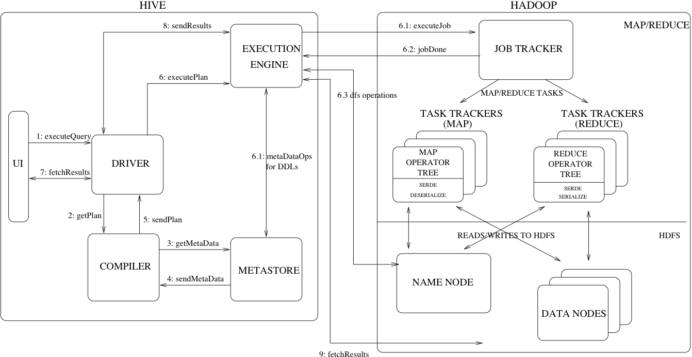
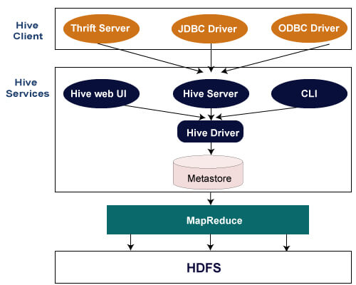
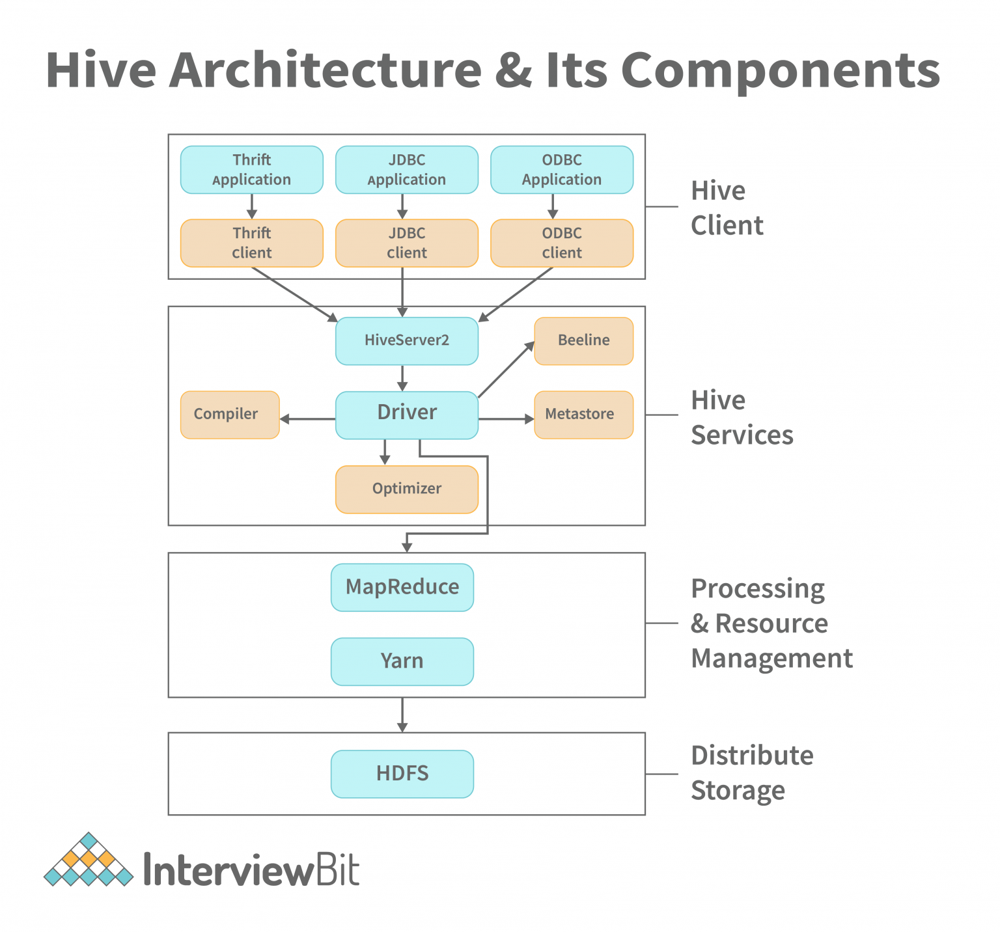
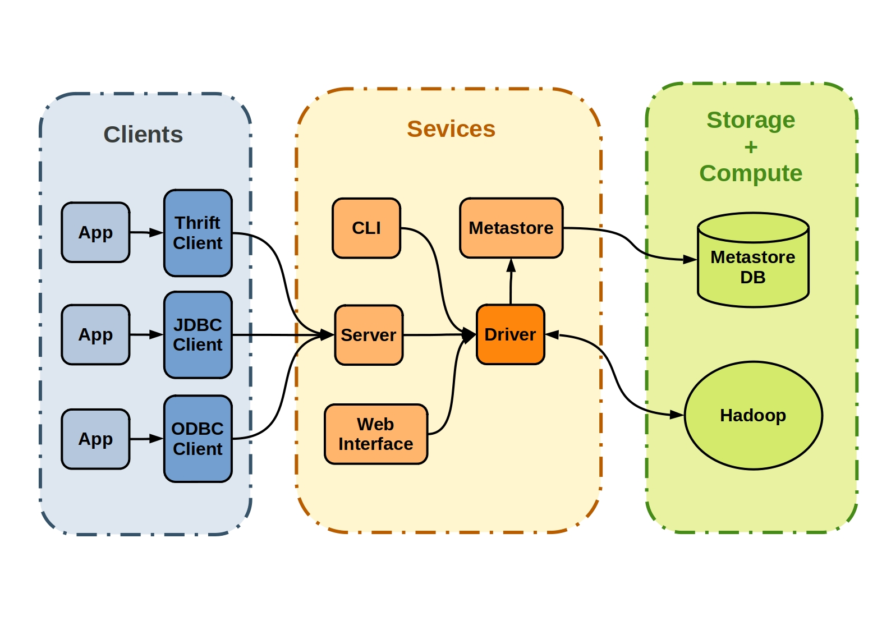

# Apache Hive

Hive is a data warehouse infrastructure built on Hadoop. It provides a set of tools for data extraction transformation loading (ETL), a mechanism for storing, querying, and analyzing large-scale data stored in Hadoop. Hive defines a simple class SQL query language called HQL that allows users familiar with SQL to query data. At the same time, the language also allows you to familiarize yourself with MapReduce developers' custom mappers and reducers to handle the complex analysis work that the built-in mapper and reducer can't.

Hive does not have a dedicated data format. Hive works fine on Thrift, controls delimiters, and allows users to specify data formats.

Hive is a combination of three components:
- Data files in varying formats that are typically stored in the Hadoop Distributed File System (HDFS) or in Amazon S3.
- Metadata about how the data files are mapped to schemas and tables. This metadata is stored in a database such as MySQL and is accessed via the Hive metastore service.
- A query language called HiveQL. This query language is executed on a distributed computing framework such as MapReduce or Tez.

Presto only uses the first two components: the data and the metadata. It does not use HiveQL or any part of Hive’s execution environment.

## Hive Architecture

<p align="center">
    
</p>

- **UI**: The user interface for users to submit queries and other operations to the system.
- **Driver**: The component which receives the queries. This component implements the notion of session handles and provides execute and fetch APIs modeled on JDBC/ODBC interfaces.
- **Compiler**: The component that parses the query, does semantic analysis on the different query blocks and query expressions and eventually generates an execution plan with the help of the table and partition metadata looked up from the metastore.
- **Metastore**: The component that stores all the structure information of the various tables and partitions in the warehouse including column and column type information, the serializers and deserializers necessary to read and write data and the corresponding HDFS files where the data is stored.
- **Execution Engine**: The component which executes the execution plan created by the compiler. The plan is a DAG of stages. The execution engine manages the dependencies between these different stages of the plan and executes these stages on the appropriate system components.


There are three parts of Hive Architecture in general:

- Hive Client
- Hive Services
- Hive Storage and Computing

<!-- <p align="center">
    
</p> -->

<p align="center">
    
</p>

<!-- <p align="center">
    
</p>

<p align="center">
    
</p> -->

### Hive Clients
In Hive, professionals can write in multiple languages such as C++, Python, Java, etc. It can be done using the following clients:

- **Thrift Server**: It is a cross-language service provider platform that serves the request from all those programming languages that supports Thrift. The Hive server can handle requests from a thrift client by using Apache Thrift.
- **JDBC Driver**: It is used to establish a connection between hive and Java applications. The JDBC Driver is present in the class org.apache.hadoop.hive.jdbc.HiveDriver.
- **ODBC Driver**: Adds ODBC protocol allowing several applications to communicate with Hadoop Hive.

### Hive Services
This section consists of the following services:

- **Hive CLI**: It acts as a Command Line Interface shell that gives professionals a way to write and execute Hive command, queries, etc.
- **Beeline (former CLI)**: HiveServer2 supports the Beeline (replaces Hive CLI), a command shell that which the user can submit commands and queries to. It is a JDBC client that utilises SQLLINE CLI (a pure Java console utility for connecting with relational databases and executing SQL queries). The Beeline is based on JDBC. Hive CLI is an Apache Thrift-based client, and Beeline is a JDBC client based on SQLLine.
- **Web User Interface**: It is a direct user interface for professionals acting as an alternative way for CLI to perform queries and commands to analyze data.
- **Hive Metastore**: It is the central repository that procures tables and partitions within a warehouse – all related metadata information, serializers, de-serializers, and columns for HDFS system files to read and modify data at any time. The Hive Server manages client connections and executes hive queries on behalf of users.
- **Hive Server 2**: It can take requests from multiple clients and forward them to Hive Driver, respectively. HiveServer2 is the successor to HiveServer1. It provides clients with the ability to execute queries against the Hive. Multiple clients may submit queries to Hive and obtain the desired results. Open API clients such as JDBC and ODBC are supported by HiveServer2.
- **Hive Driver**: It accepts queries from all sources such as CLI, Web UI, JDBC/ODBC, and Thrift to forward them to the Compiler. It conducts semantic analysis on different query blocks and expressions, generating an execution plan with the Compiler. The plan, represented as a DAG, is created using table and partition metadata from the metastore. The hive package's jar files aid in converting HiveQL queries.
- **Hive Compiler**: It has the responsibility to change HQL statements into MapReduce, respectively.
- **Optimizer**: The optimizer splits the execution plan before performing the transformation operations so that efficiency and scalability are improved.
- **Hive Execution Engine**: Optimizer generates the logical plan in the form of DAG of map-reduce tasks and HDFS tasks. In the end, the execution engine executes the incoming tasks in the order of their dependencies. The Execution Engine in Hive is responsible for converting user queries into actionable tasks. It supports both MapReduce and Apache Tez as execution engines. The Engine crafts a query plan, introduces operators and expressions for data processing, and executes queries, akin to a relay race passing the baton from one stage to another. It plays a crucial role in the efficient execution of HiveQL queries and their translation into MapReduce jobs.
- **HCatalog**: HCatalog is a Hadoop table and storage management layer that provides users with different data processing tools such as Pig, MapReduce, etc. with simple access to read and write data on the grid. The data processing tools can access the tabular data of Hive metastore through It is built on the top of Hive metastore and exposes the tabular data to other data processing tools.
- **WebHCat**: The REST API for HCatalog provides an HTTP interface to perform Hive metadata operations. WebHCat is a service provided by the user to run Hadoop MapReduce (or YARN), Pig, and Hive jobs.


> Hive server1, which is also known as a Thrift server, is used to communicate with Hive across platforms. Different client applications can submit requests to Hive and receive the results using this server. HiveServer2 handled concurrent requests from more than one client, so it was replaced by HiveServer1.

#### Driver
The core and central control of the Hive Services is the so-called driver. This
receives HiveQL commands and is responsible for their execution against the Hadoop system. It typically consists of a compiler that translates HiveQL requests into abstract syntax and executable tasks, an optimizer that aggregates, splits, and optimizes for better performance and scalability, and an executor that interacts with Hadoop’s job tracker and passes tasks to the system for execution.

Apache Hive also provides the ability to submit these tasks directly to the driver. Using the Command Line and User Interface (CLI + UI), it is possible to directly influence the process.

### Hive Storage and Computing
Now moving further from Hive services, storage and computing take into account the following tasks:

- Data information is stored in the Hive at Meta Storage database.
- While data loaded and query results are stored at Hadoop clusters across HDFS.

### Hive Features
Essential features of Hive include:

- Hive’s primary function is to query and manage structured data inside the tables.
- Hive represents a fast, scalable, and Datawarehouse ETL tool.
- In Hive, you will find the support for multiple file formats that include ORC, TEXTFILE, RCFILE (Record Columnar File), and the SEQUENCE FILE.
Hive follows the same concepts for storing data as columns, rows, tables, sequences, and schema such as SQL, thus lowering the complexities of MapReduce - programming.
- Processed data is stored in the Hadoop Distributed file system (HDFS) during schema in the database only.
- Hive also has built-in support for user-defined functions (UDFs) to change the data and another tool.
- Hive allows the use of compressed data stored within the Hadoop ecosystem.
- In Hive, data partitioning allows for quick query retrieval and enhances performance.
- Hive also supports using different commands through Data Manipulation Language (DML), Data Definition Language (DDL), and UDFs.

> Hive is not a relational database or any language to get real-time queries. Hive acts as a platform or tool to write and execute queries from Hadoop.

## Metastore - HMS
The Metastore provides two important but often overlooked features of a data warehouse: data abstraction and data discovery. Without the data abstractions provided in Hive, a user has to provide information about data formats, extractors and loaders along with the query. In Hive, this information is given during table creation and reused every time the table is referenced. This is very similar to the traditional warehousing systems. The second functionality, data discovery, enables users to discover and explore relevant and specific data in the warehouse. Other tools can be built using this metadata to expose and possibly enhance the information about the data and its availability. Hive accomplishes both of these features by providing a metadata repository that is tightly integrated with the Hive query processing system so that data and metadata are in sync.

Metastore is an object store with a database or file backed store. The database backed store is implemented using an object-relational mapping (ORM) solution called the DataNucleus. The prime motivation for storing this in a relational database is queriability of metadata. Some disadvantages of using a separate data store for metadata instead of using HDFS are synchronization and scalability issues. Additionally there is no clear way to implement an object store on top of HDFS due to lack of random updates to files.

## Hive Data Model
Data in Hive is organized into:

- **Tables**: These are analogous to Tables in Relational Databases. Tables can be filtered, projected, joined and unioned. Additionally all the data of a table is stored in a directory in HDFS. Hive also supports the notion of external tables wherein a table can be created on prexisting files or directories in HDFS by providing the appropriate location to the table creation DDL. The rows in a table are organized into typed columns similar to Relational Databases.
- **Partitions**: Each Table can have one or more partition keys which determine how the data is stored, for example a table T with a date partition column ds had files with data for a particular date stored in the `<table location>/ds=<date>` directory in HDFS. Partitions allow the system to prune data to be inspected based on query predicates, for example a query that is interested in rows from T that satisfy the predicate T.ds = '2008-09-01' would only have to look at files in `<table location>/ds=2008-09-01/` directory in HDFS.
- **Buckets**: Data in each partition may in turn be divided into Buckets based on the hash of a column in the table. Each bucket is stored as a file in the partition directory. Bucketing allows the system to efficiently evaluate queries that depend on a sample of data (these are queries that use the SAMPLE clause on the table).


## Limitations of Hive
While there are significant Hive Benefits, there are still some limitations that exist in operating Hive:

- Hive does not process the ability to handle real-time data and analysis.
- Hive Queries possess a high level of latency.
- Hive architecture does not support the use of online transaction processing.

## Hive vs HBase
Here are the main Hive and HBase differences that you should know in grasping the fundamentals of Apache software:

- Hive is built and runs on top of the Hadoop, while HBase operates on top of the HDFS.
- HBase is an open-source database management system with more inclined towards unstructured data, while Hive operates mainly towards structured data.
- Hive prefers and is suited for high latency operations, whereas HBase is more inclined towards low-latency operations.
- Hive’s primary function is directed towards analytical querying, while Hbase follows real-time querying.
- Hive has its use in batch processing, whereas Hbase is predominantly transactional processing.
- Hive prefers a schema model while HBase doesn’t.
- HBase supports NoSQL databases, while Hive is an ETL tool for databases with no support for databases.

## When to use Hive
- Hive’s primary use lies in analyzing huge files and processing structured data.
- Writing and executing queries as SQL-like statements by HQL.
- Perform tasks at an unprecedented pace with improved results.
- Hive for Data Analysis has shown tremendous results in several industry aspects.

Apache Hive enables users to quickly and easily manage large datasets, facilitate ad-hoc analysis and query without complex MapReduce code, thereby streamlining big data analysis for data warehousing and business intelligence.

## Running it locally

```shell
docker compose up -d
```

# Referencies
- [Hive Architecture - Documentation](https://cwiki.apache.org/confluence/display/Hive/Design)
- [Hive Architecture - 1](https://www.javatpoint.com/hive-architecture)
- [Hive Architecture - 2](https://starship-knowledge.com/apache-hive-architecture)
- [Hive Architecture - 3](https://www.interviewbit.com/blog/hive-architecture/)
- [What is Hive](https://u-next.com/blogs/business-analytics/what-is-hive/)
- [Hive Free Book](https://github.com/Prokopp/the-free-hive-book/blob/master/the-free-hive-book.md#introduction)
- [Hadoop, Hive, Parquet, Hue and Docker](https://towardsdatascience.com/making-big-moves-in-big-data-with-hadoop-hive-parquet-hue-and-docker-320a52ca175)
- [Installing Hive and Hadoop locally](https://sunchao.github.io/posts/2016-11-13-installing-hive-and-hadoop-locally.html)
